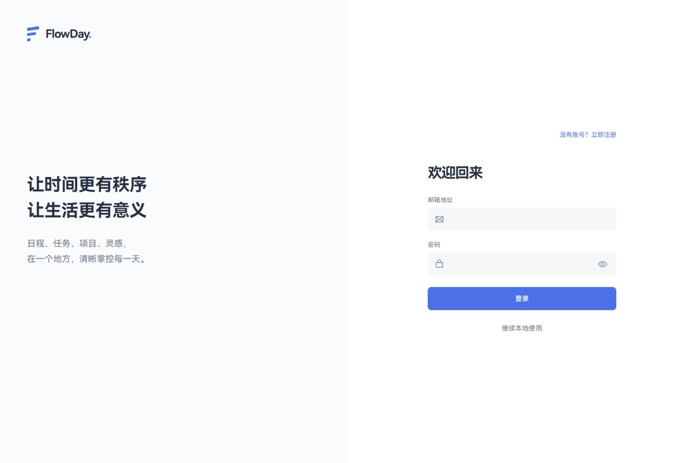
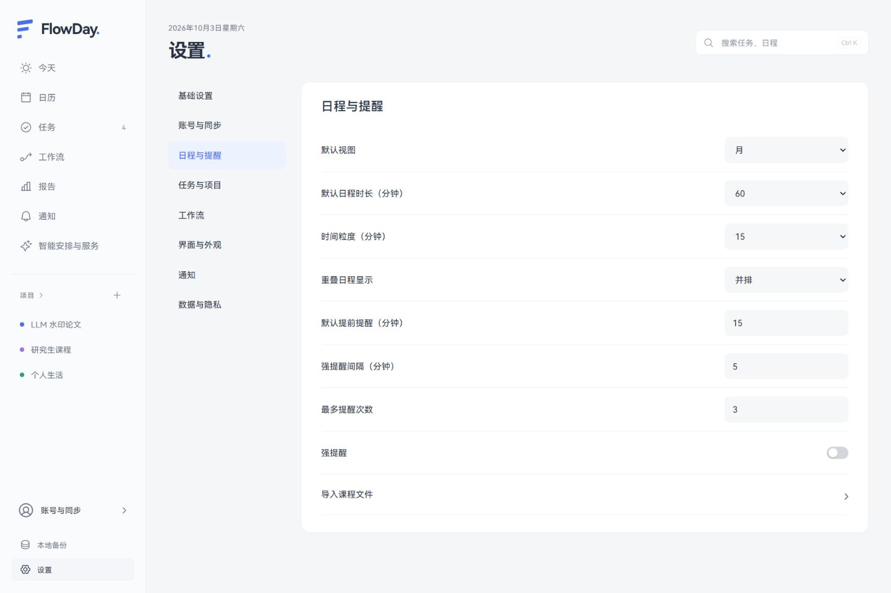
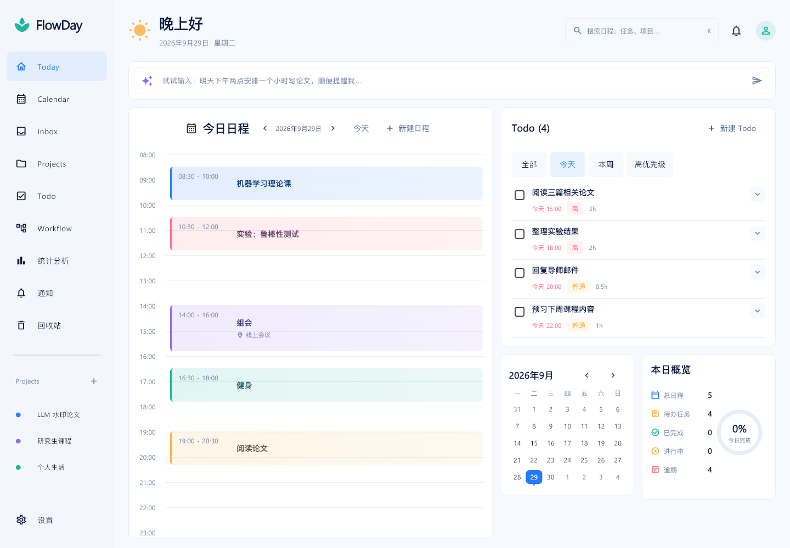
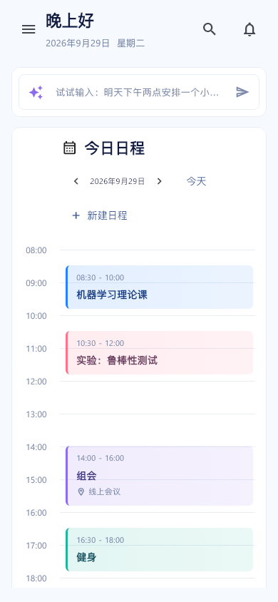

# FlowDay

FlowDay 是日程、任务、项目与工作流应用，配套独立部署的 Node.js 服务。0.2.0 提供 React + TypeScript + Tauri 2 的 Windows 客户端；原 Flutter 跨平台工程保留在仓库中。

## 0.2.0

[下载 Windows x64 安装包](https://github.com/Ray-315/flowday/releases/download/v0.2.0/FlowDay-0.2.0-x64-setup.exe) · [发行说明和校验文件](https://github.com/Ray-315/flowday/releases/tag/v0.2.0)

新客户端位于 [react-client](react-client/README.md)，包含今日模块、任务与项目、五种日历视图、工作流、账号与同步、服务、课程导入、报告及原生本地保存。登录使用独立页面，设置按功能分类，公共控件和图标统一。

```powershell
cd react-client
npm ci
npm run dev
# Windows 原生客户端：需要 Rust、Microsoft C++ Build Tools 和 WebView2
npm run tauri -- dev
npm run tauri -- build --bundles nsis
```

0.2.0 发行包为 Windows x64。React/Tauri 的 iOS、Android 和 macOS 发行包及灵动岛尚未完成；Apple、飞书、邮件和 AI 服务的真实账号验收范围见 [迁移记录](docs/react-production-migration.md)。服务端兼容补丁随源码提供，发布 GitHub 不会自动更新生产服务。





## 原 Flutter 客户端运行

直接双击 `build\windows\x64\runner\Release\flowday.exe`，或运行：

```powershell
.\scripts\run-windows.ps1
```

移动应用时复制整个 `Release` 文件夹，包括 `data` 和 DLL。

## 开发与验证

本机 Flutter SDK：`.tools\flutter`。脚本自动使用此 SDK；其他电脑可安装 Flutter 后使用 PATH 中的 Flutter。

```powershell
.\scripts\flutter.ps1 pub get
.\scripts\flutter.ps1 analyze
.\scripts\flutter.ps1 test
.\scripts\flutter.ps1 build windows --release --no-pub
.\scripts\flutter.ps1 run -d windows --no-pub
```

若 Windows 未开启开发者模式，首次 `pub get` 可能在已解析完依赖后报告 symlink 权限错误。再次通过脚本执行 build/run 时，脚本会为 Windows/Linux 插件准备目录联接；不更改系统设置。

网络较慢时，可仅在当前终端使用 Flutter 国内镜像：

```powershell
$env:PUB_HOSTED_URL = 'https://pub.flutter-io.cn'
$env:FLUTTER_STORAGE_BASE_URL = 'https://storage.flutter-io.cn'
```

平台打包（需对应 SDK/操作系统）：

```text
flutter build apk
flutter build ios --no-codesign
flutter build macos
flutter build linux
```

## 使用

设置页现已包含十个分类、外观与工作流偏好、账号安全和备份恢复，详见 [设置实现核对](docs/settings-implementation.md)。

1. 在 Projects 中创建项目，项目菜单可打开子项目或编辑父级。
2. 在 Todo 中创建任务，点击任务打开详情；添加一个或多个时间块。
3. 在 Calendar 查看/编辑时间安排；完成唯一时间块自动完成任务。
4. Workflow 选择项目后添加节点；点击节点右侧连接点，再点击目标节点建立依赖。
5. 设置中导出 JSON 或从备份恢复。

桌面使用侧栏和右侧详情；手机使用抽屉导航和全屏详情。业务和存储代码共用。首次运行为空数据。

## 文件结构

- `lib/domain/`：模型、校验、状态机与日历分列。
- `lib/data/`：本地 JSON 存储、账号隔离、API 客户端、版本同步与冲突处理。
- `lib/ui/`：页面、详情编辑器与响应式导航。
- `test/`：领域、仓储、交互及布局测试。
- `windows/`、`macos/`、`linux/`、`android/`、`ios/`：原生平台工程。
- `docs/`：原始 PRD、实施计划、功能状态和布局预览。
- `image/`：原始示意图，未修改。
- `server/`：独立 HTTP API、SQLite、后台任务和 Docker 部署。

## 布局预览

以下使用测试数据，实际应用不会自动创建这些内容。





## 服务器与账号

后端部署说明见 [server/README.md](server/README.md)，接口见 [docs/backend-api.md](docs/backend-api.md)。在设置中选择“账号与同步 → 登录”，填写自己的 HTTPS 服务地址；本机开发可用 `http://127.0.0.1:3108`。可注册或登录，然后手动同步或开启自动同步。

已有本地数据仍保留在原目录。登录账号使用按服务器和用户隔离的缓存，不自动上传访客数据。版本冲突时可选择服务器或本地副本，替换本地前创建备份。令牌只保存在内存中，重启需要重新登录；同步基线会保留。

服务端已有提醒、AI 预览/确认和备份接口；客户端对应操作入口尚待接入。Apple Calendar、原生通知和其他剩余功能见实现状态文档。应用没有遥测。
